# Description
The project contained in this repository functions as a CRM that allows for authenticated users to manage a set of customers and balances in a centralized place.

## Features
- Authentication
	- New user creation
	- Registered user login
	- Cascading permission levels (Admin\>User\>Visitor)
	- Only Admins can change passwords
	- User/session logout
	- `whoami` status on the main page
- Customer management
	- Customer details table
	- Users can add/edit/remove customers and balances

# Setup
## Requirements
To run this project, the server must be running **Glassfish 7** with an accessible **MySQL 9** server. The following instructions will connect Glassfish to a JDBCRealm database inside the MySQL server.

## Database
The MySQL database is assumed to be running on port 3306.

Three SQL scripts are located under `configuration/database/*`. Run these scripts against a fresh MySQL database to prepare the data.
### Users
```sql
create table if not exists USERS
(
    USERID   varchar(255) not null
        primary key,
    PASSWORD varchar(255) not null
);

INSERT INTO jdbcrealm.USERS (USERID, PASSWORD) VALUES ('admin', 'admin1234');
INSERT INTO jdbcrealm.USERS (USERID, PASSWORD) VALUES ('callum', 'ward');
INSERT INTO jdbcrealm.USERS (USERID, PASSWORD) VALUES ('carter', 'password');
INSERT INTO jdbcrealm.USERS (USERID, PASSWORD) VALUES ('jerry', 'jerry1234');
INSERT INTO jdbcrealm.USERS (USERID, PASSWORD) VALUES ('sanjay', 'gupta');
```
### Groups
```sql
create table if not exists USERS_GROUPS
(
    GROUPID varchar(20)  not null,
    USERID  varchar(255) not null
        primary key
);

INSERT INTO jdbcrealm.USERS_GROUPS (GROUPID, USERID) VALUES ('admin', 'admin');
INSERT INTO jdbcrealm.USERS_GROUPS (GROUPID, USERID) VALUES ('user', 'callum');
INSERT INTO jdbcrealm.USERS_GROUPS (GROUPID, USERID) VALUES ('user', 'carter');
INSERT INTO jdbcrealm.USERS_GROUPS (GROUPID, USERID) VALUES ('user', 'jerry');
INSERT INTO jdbcrealm.USERS_GROUPS (GROUPID, USERID) VALUES ('user', 'sanjay');

```
### Customers
```sql
create table if not exists CUSTOMERS
(
    ID      int          not null
        primary key,
    Name    varchar(255) null,
    Balance float        null
);

INSERT INTO jdbcrealm.CUSTOMERS (ID, Name, Balance) VALUES (1, 'Kratos Concrete', 2500);
INSERT INTO jdbcrealm.CUSTOMERS (ID, Name, Balance) VALUES (2, 'BW\'s Pub', 700);
INSERT INTO jdbcrealm.CUSTOMERS (ID, Name, Balance) VALUES (3, 'The Curiosity Shop', 57650);
INSERT INTO jdbcrealm.CUSTOMERS (ID, Name, Balance) VALUES (4, 'Aperture Science', 13000);
INSERT INTO jdbcrealm.CUSTOMERS (ID, Name, Balance) VALUES (5, 'Umbrella Corporation', 98750);
INSERT INTO jdbcrealm.CUSTOMERS (ID, Name, Balance) VALUES (6, 'Chocobo Farm', 3200);
INSERT INTO jdbcrealm.CUSTOMERS (ID, Name, Balance) VALUES (7, 'Rapture Fisheries', 6700);
INSERT INTO jdbcrealm.CUSTOMERS (ID, Name, Balance) VALUES (8, 'Black Mesa Research', 42000);
INSERT INTO jdbcrealm.CUSTOMERS (ID, Name, Balance) VALUES (10, 'Shinra Electric Power Company', 150000);
INSERT INTO jdbcrealm.CUSTOMERS (ID, Name, Balance) VALUES (11, 'Vault-Tec Corporation', 76500);
INSERT INTO jdbcrealm.CUSTOMERS (ID, Name, Balance) VALUES (12, 'Nook\'s Cranny', 25600);
INSERT INTO jdbcrealm.CUSTOMERS (ID, Name, Balance) VALUES (13, 'Tricell Pharmaceuticals', 87300);
INSERT INTO jdbcrealm.CUSTOMERS (ID, Name, Balance) VALUES (14, 'Freddy Fazbear\'s Pizza', 4200);

```

## Glassfish
The following instructions assume the admin console is available on port 4848. We will need to login to the console to setup the database and authentication.

### Driver
Before connecting to the MySQL server, the Glassfish server must be provided with the required driver class. The connector can be downloaded from the [MySQL Website](https://dev.mysql.com/downloads/connector/j/) as a `Platform Independent (Architecture Independent), ZIP Archive`.

Inside the root level of the zip file, take the file named `mysql-connector-j-9.1.0.jar` and move it to `/$GLASSFISH_HOME/glassfish/lib/`. Reboot Glassfish to properly load the driver.

### Connection Pool
First, a connection pool will need to be configured to connect to a MySQL database in which to store the user and customer accounts.

Navigate to the JDBC Connection Pools folder, then click to add a new Connection Pool.
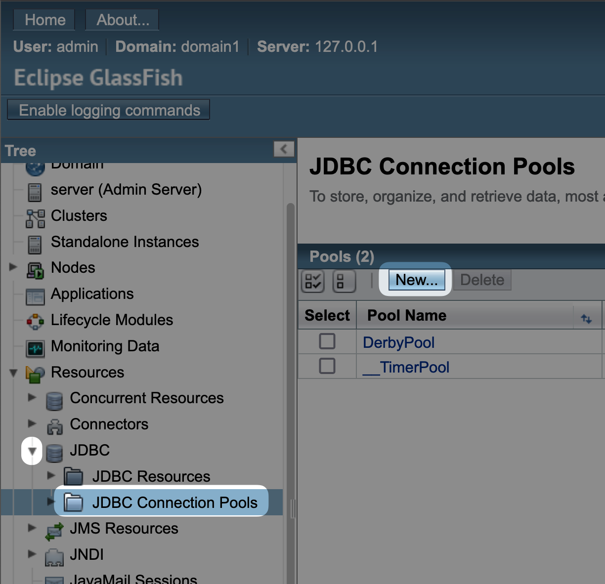
Fill in the following details for the Connection Pool, then click Next.
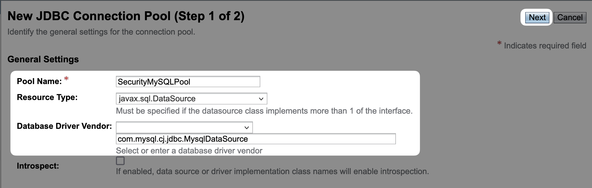
> Pool Name: `SecurityMySQLPool`

> Resource Type: `javax.sql.DataSource`

> Database Driver Vendor: `com.mysql.cj.jdbc.MysqlDataSource`

At the top, fill in the Datasource Classname.  
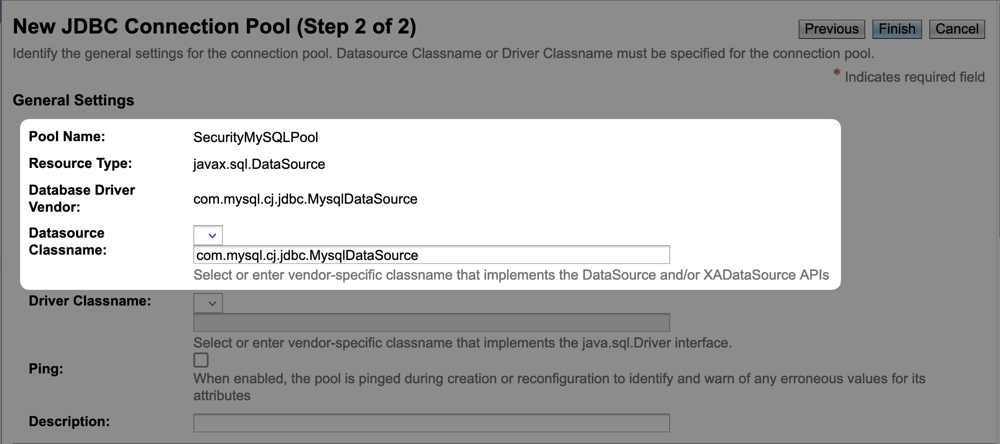
> Datasource Classname: `com.mysql.cj.jdbc.MysqlDataSource`

At the bottom, fill in the Additional Properties, then click Finish.
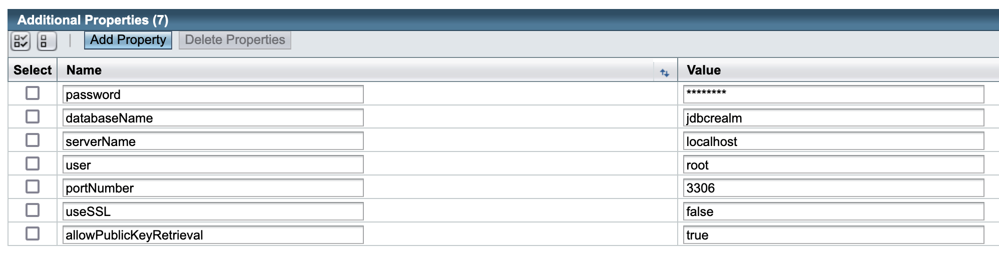
> Password: \<your database password\>

> databaseName: `jdbcRealm`

> serverName: `localhost`

> user: `root`

> portNumber: `3306`

> useSSL: `false`

> allowPublicKeyRetrieval: `true`

### Resource
Now that the Connection Pool has been created to the database, we must add it as a Data Source before we can use it in the security Realm. Navigate to JDBC Resources, then click New.
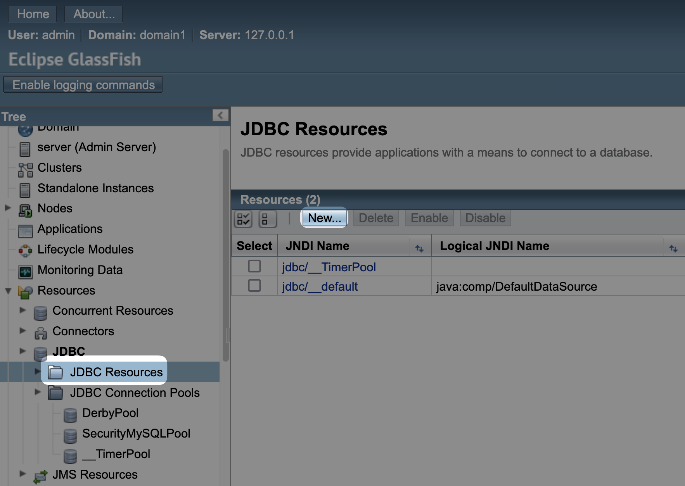

Fill in the JNDI Name and set the pool to the one previously created.
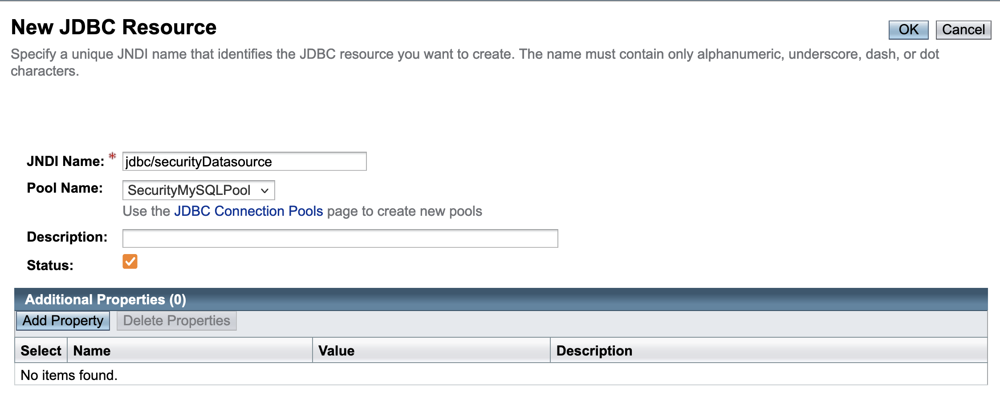
> JNDI Name: `jdbc/securityDatasource`

> Pool Name: `SecurityMySQLPool`

### Realm
Now that the connection pool has been established and the datasource provided to Glassfish, we can create a new Realm to use for authentication.

Navigate to the Realms folder in the server-config.
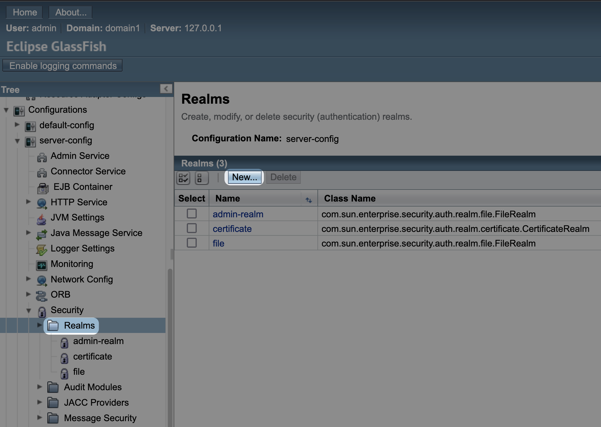

At the top, fill in the Name and Class Name.
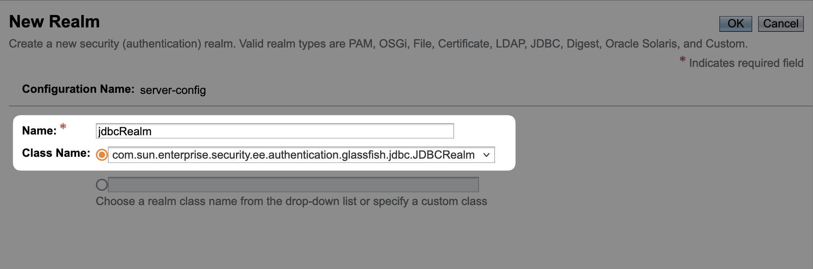
> Name: `jdbcRealm`

> Class Name: 
`com.sun.enterprise.security.ee.authentication.glassfish.jdbc.JDBCRealm`

Fill in the rest of the Realm properties.
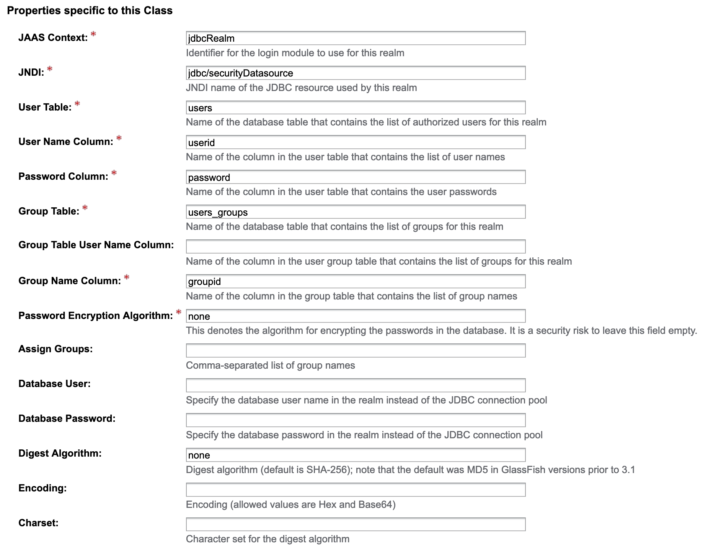
> JAAS Context: `jdbcRealm`

> JNDI: `jdbc/securityDatasource`

> User Table: `users`

> User Name Column: `userid`

> Password Column: `password`

> Group Table: `users_groups`

> Group Name Column: `groupid`

> Password Encryption Algorithm: `none`

> Digest Algorithm: `none`

#### Optional: Set to Default Realm
Normally, applications will define a level of authentication that is appropriate for them. For our use case, we can default all applications to use our new Realm.

Navigate to the Security section of the server-config and set the Default Realm to jdbcRealm, then click Save.
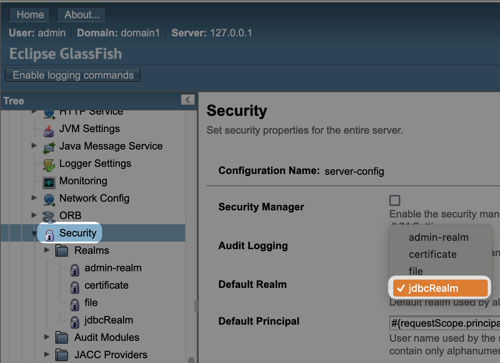

# Building & Deployment
## Building
This project uses Maven for build pipelines and dependency management. First, ensure Maven is installed in your environment or IDE, then run the following commands to validate and package the `.war` file for deployment.
> mvn clean
> mvn validate
> mvn compile
> mvn package
When these steps are complete, the output will be located in the target folder.
> target/csci3830-finalproject-1.0.war

## Deployment
Deployment to Glassfish server can be done through the admin console. Navigate to Applications and Deploy a new application.
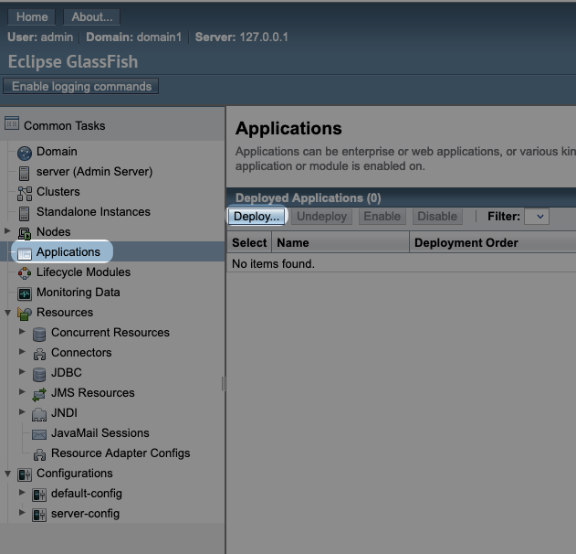

Use the system file picker to choose the generated `.war`.
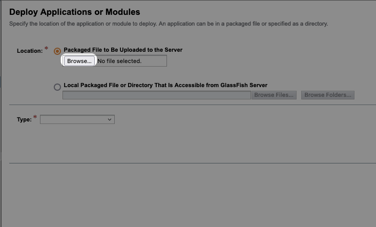

The expanded options can be safely ignored, click OK at the top right to complete the deployment.

Once the deployment is complete, the application is now available relative to the Glassfish server URL at `/csci3830-finalproject-1.0/`.